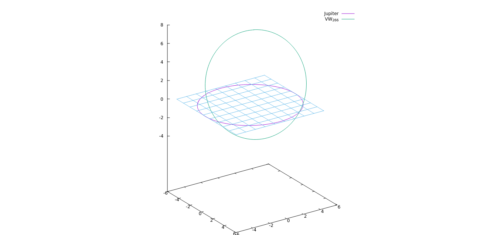

# Asteroids

This project study the asteroid 2007 VW266. It is based on the article: [A retrograde object near
Jupiter’s orbit](https://www.sciencedirect.com/science/article/abs/pii/S0032063317302453?via%3Dihub). In this paper, the researchers study the asteroid 2007 VW266 because it holds a special place
in our solar system. It is one of the rare object with a heliocentric retrograde orbit, and it is in 13/14
retrograde mean motion resonance with Jupiter. This orbit is only temporarily stable, and the study
estimate that the asteroid will leave it in about 8000 years. This temporary stable state is due to an
elliptic orbit
with high inclination. Here, we try to reproduce the results found by the authors
by performing a numerical simulation.

## Result



This is an example of some output realised with the program, you can find more details in the [paper](ResultPaper.pdf)

## Technologies

The main simulation is using C++ while the prototype (available in its branch) is written in Python.
* C++ 20
* Cmake 3.12
* gcem: latest
* glm: latest

Optional: 
* Doxygen
* Sphinx
* Python: 3.8


## Installation

Once you cloned the repo, create and enter a build dirctory:
```bash
$ mkdir build
$ cd build
```

Then you need to launch cmake and compile the project
```bash
$ cmake ..
$ make
```

*Note: you can add `-DSANITINE=ON` or `-DBUILD_DOC=ON` before `..` on the cmake command if you want to respectively compile with sanitizers or build the documentation.*

Finally, you can launch the programm using 
```bash
$ ./Asteroids
```

## Authors

- [@LucasChollet](https://github.com/LucasChollet)
- [@VBoulenger](https://github.com/VBoulenger)
- [@Emmanuel-IPSA](https://github.com/Emmanuel-IPSA) 

